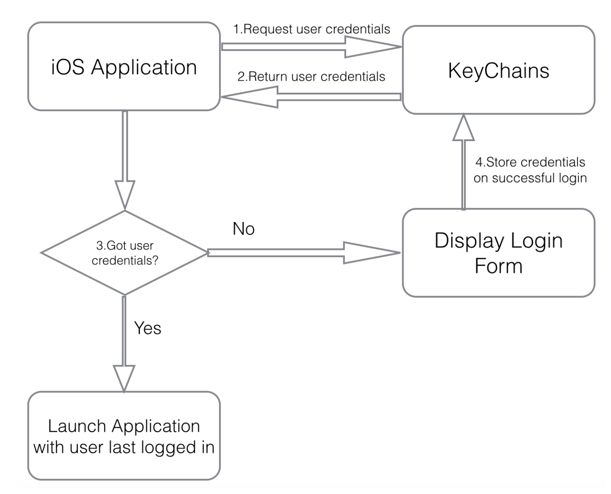

##CloudKibo (iOS) Design Document
## Application Delegate
This class is responsible for setting up tasks for launching application, terminating application, running application in background, bringing application in foreground. This class connects the application to socket.io . Also it makes sure that we close our socket.io service before the application is terminated.It is also responsible for retrieving any data stored in device Key chains. For example, user’s login credentials are retrieved(if saved) when application is launched.
## Database Handler
We have this utility class which we use in all our application to store and retrieve data from local SQLite database of our application. It has separate functions to fetch data from each table. We also use functions to store data in table. We don’t deal with the database instance in all our application. We just create one database instance in this utility class and rest of the application invokes functions of this class to talk to database.
## Socket.io Component
These is a separate component which handles sockets. It has socket handlers. It has details of what to listen on socket. It has a separate function for emitting message on socket. This
function can be accessed throughout application for emitting socket messages to CloudKibo Server. Socket delegates are defined for handling socket messages. Delegates are responsible for notifying whenever a socket message is received. Notification is sent to the class which ha implemented socket delegates. That class then take the action required based on type of socket message received.
## Delegates/Protocols
Delegation is a design pattern that enables a class or structure to hand off (or delegate) some of its responsibilities to an instance of another type.
Here is an example delegate used in our application. This sample delegate defines protocols for receiving different types of Socket messages for WebRTC call:
protocol SocketClientDelegateWebRTC:class
{
func socketReceivedMSGWebRTC(message:String,data:AnyObject!);
func socketReceivedOtherWebRTC(message:String,data:AnyObject!);
func
socketReceivedMessageWebRTC(message:String,data:AnyObject!);
}

## Constants Class
This class stores our REST API addresses values in constant variables which are accessible throughout application. These
constants are refrenced in our application. This helps to maintain consistency. If there is any change in our URL or rest API, we will have to make changes in this file only. Below are details of REST API urls as stored in this class:
static let MainUrl="https://api.cloudkibo.com"
static let authentictionUrl="/auth/local/"
static let bringUserChat="/api/userchat/"
static let getCurrentUser="/api/users/me"
static let getContactsList="/api/contactslist/"
static let room="globalchatroom"
static let addContactByUsername="/api/contactslist/ addbyusername"
static let addContactByEmail="/api/contactslist/addbyemail"
static let markAsRead="/api/userchat/markasread"
static let getSingleUserByID="/api/users/" //send if along
static let removeChatHistory="/api/userchat/removechathistory"
static let removeFriend="/api/contactslist/removefriend"
static let getPendingFriendRequestsContacts="/api/contactslist/ pendingcontacts"
static let rejectPendingFriendRequest="/api/contactslist/ rejectfriendrequest"
static let approvePendingFriendRequest="/api/contactslist/ approvefriendrequest"
static let createNewUser="/api/users/"
## View Controllers
Swift language works on Model View Controller(MVC) framework. Our application has View Controllers to show different screens of our application. Following diagram gives details of our main views:


## Open Source External Libraries
Our iOS application uses some of Open Source libraries. Details of those libraries are provided below:

## SwiftyJSON Library
SwiftyJSON makes it easy to deal with JSON data in Swift.

## KeyChainsWrapper Library
This is an open source library for storing data at persistent place on device. Our application is using this library for storing user user,s login credentials, example: Authentication Token, username and password. Keychains are safe place to store such information. This API helps to retrieve data when application is re launched after termination. Thus, user will not have to login every time.


## Alamofire Library
Alamofire is an HTTP networking library written in Swift. Our application uses this library for making any network requests from Cloudkibo Server. All REST API requests use this library for GET or POST requests from server.
## WebRTC Library
Our iOS application uses a WebRTC library named “libjingle_peerconnection”.The code that implements WebRTC native APIs (including the Stream and the PeerConnection APIs) are available in this library.
## SQLite Library
This is a type-safe, Swift-language layer over SQLite3. SQLite.swift provides compile-time confidence in SQL statement syntax and intent. Our application uses this API for creating database connection, creating tables, adding and retireving data from SQLite database.

##Kibo App 1-1 Call Logic:

##Comparison of current Cloudkibo model with Cloudkibo

