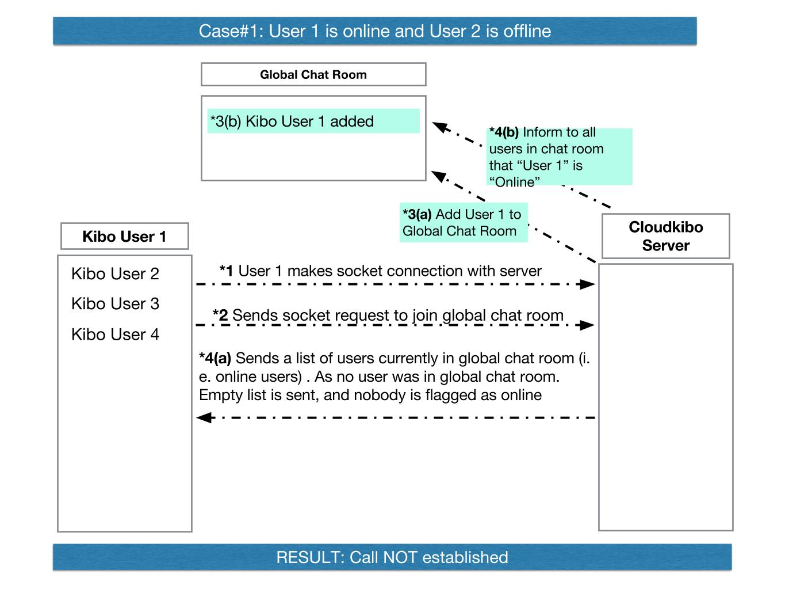
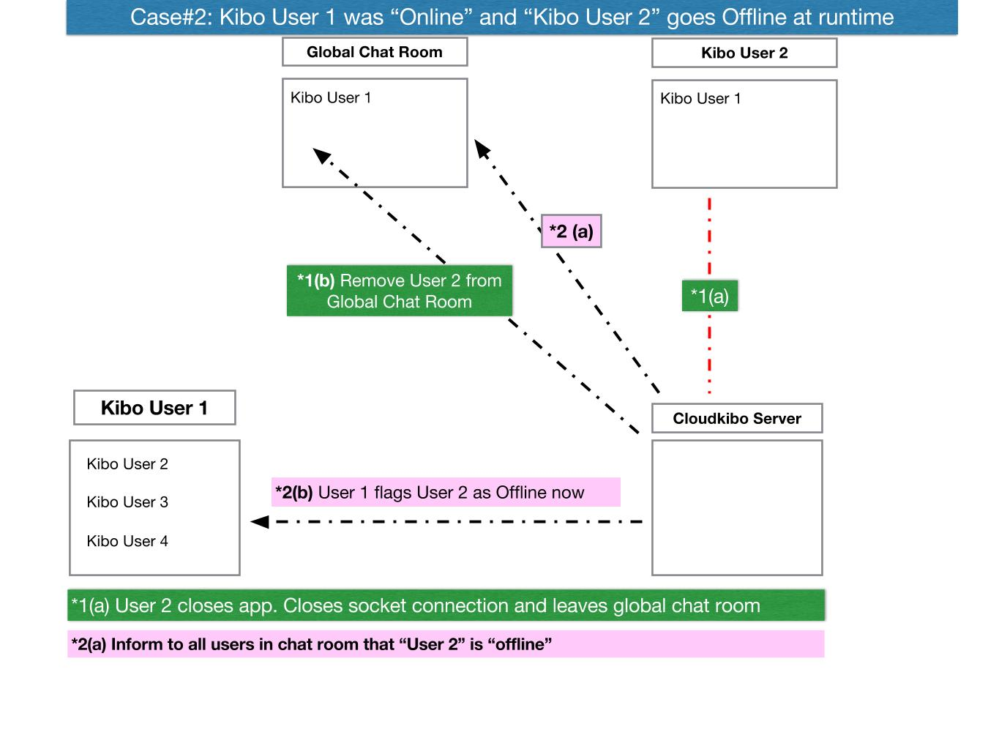
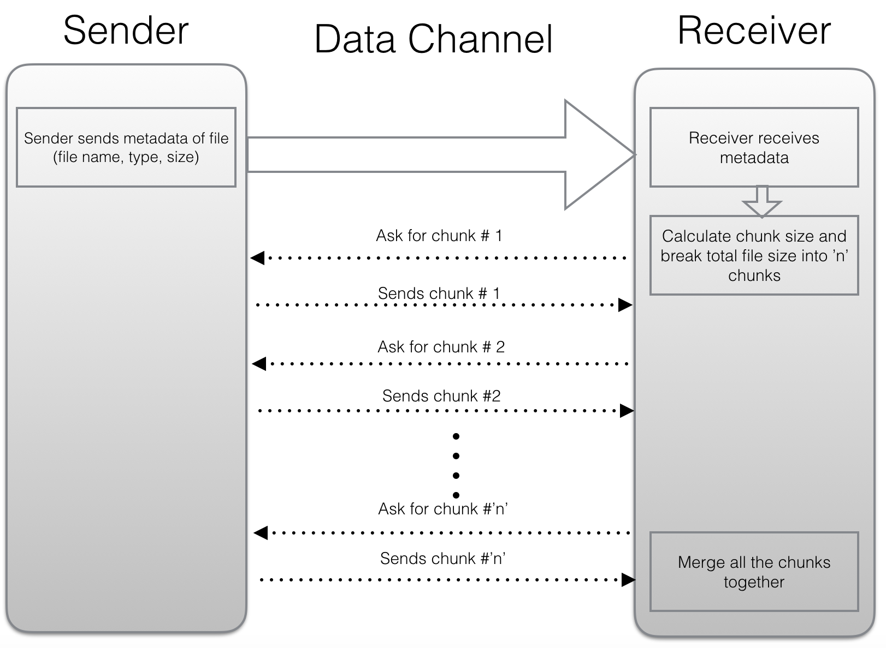

## Kibo Application ##
Kibo App is a next generation communication iOS application. It’s intuitive, cost effective, and rich with functionality. It can be used both for internal and external communications. It provides integrated and unified voice, video, and data communication.

**Features & Characteristics**
Our Application provides following features:

 - Instant Chat
 Somethings are just better to write and send. With Kibo App, use our chat messaging system to send instant messages to your dear ones.
 
 - Audio/Video Call
Kibo App lets you invite your friend with a click of a button into a call. Don’t get tied down to a clumsy keypad and cryptic codes to control and manage your calls.

 - File Transfer
 Kibo App makes it simple for you or anyone in your call to instantly share notes, documents, videos, or any other file. File transfer is highly secured.

**Kibo App Documentation**

[Kibo App Design document](https://github.com/Cloudkibo/iOS/blob/master/Documentation/sections/design.md) discusses about internal code design of application. It discusses about how code is arranged, which internal and external libraries are being used. This document is more suitable and relevant for developers.

## Contacts Management in Kibo App ##

Each device has to maintain local copy of data of user in sqlite database. We do this so that data is shown to user even when offline. We synchronise local database with server database at the time of installation of application.

**Adding a friend**

Your friend's phone number must be in your phone's address book in order for you to start a chat with them in KiboApp.

If you cannot see your friend in WhatsApp, please follow these steps:

1- Ensure that your friend has KiboApp installed on their phone.

2- Double check that your friend's phone number is  entered correctly in your phone's address book.

- Enter the number same as you would if you were to make a phone call to that person.

- If this is an international phone number, do not use any exit codes or leading 0s. Start all international phone numbers with a + sign, followed by the country code.

3- Open KiboApp and open the Favorites list. It will show Contacts which are on KiboApp

Contacts in your phone's address book that have KiboApp will be displayed in the Favorites list (Contacts tab on Android). In KiboApp, you can only start a chat with these contacts.

If you still do not see your friend in your KiboApp list, it is possible that your friend does not have KiboApp.

**Contacts in Database on Server**

On server side, our data is stored in Mongodb database. At the time of installation, we use Facebook AccountKit to authenticate phone number using SMS. It asks user to select country code from a list, enter mobile number and display name. After verification, contact details are stored on server in "accounts" table. Here is an example:

"phone":"+14258909414"
"country_prefix":"1"
"national_number":"4258909414"
"display_name":"jawaid"

For contacts, we have a mongodb collection called contactslist. 

**Contacts in Kibo Application Database**

Kibo application expose functions like :

Invite contact
Load contacts from server
Store/load contacts to and from sqlite database
Do proper synchronization to update data on both sides

In sqlite database, we have the replica table of contactslist table of server. One other table that we have on iOS local database is to store contacts from user's address book (shown in Contacts tab). This table has following fields:

name
phone
kiboContact (Yes/No)

Here is a basic flow diagram for Contacts Management:

**Inviting new Contact**
From our Addressbook, some of contacts might not be Kibo users i.e. they have not registered themselves on Kibo App. In order to communicate with them using Kibo App, they should register on Kibo App. There are two ways for inviting any contact to Kibo App:

1- Inviting through Email
2- Inviting through SMS

- Inviting through Email

For each contact, we will store primary email address (if available) in local database. We will show the list of those users which are not on Kibo App and we have their email address saved in address book.

User can select one or more contacts from the list and email invitations will be send to selected user. User will be displayed a pre-written message:

Hey,

I just downloaded Kibo App on my iPhone. It is a smartphone messenger with added features. 

It provides integrated and unified voice, video, and data communication.

It is available for both Android and iPhone and there is no PIN or username to remember.

User can modify and make changes to this message. There is a functionality for sending invites to multiple contacts in one go.

- Inviting through SMS

For each contact, we store phone number in our local database. We will show the list of those users which are not on Kibo App. We show a list with their Names and Phone numbers.

User can select one or more contacts from the list and SMS invitations will be send to selected user. User will be displayed same pre-written message shown above. This message is editable.

## Presence(Online/Offline) Design Logic##
------------------------------------------------------

In our Kibo App, we keep track of which of our friends are currently online on app. 
Detailed design of how we maintain "Presence" feature is here:

File sharing in Kibo App
------------

File sharing feature will be available at two places in our application.

    1- During 1-1 call File Transfer
    2- File Transfer in Chat (outside call)

We will discuss both of them here:

## Design For File sharing during (1-1 call) in Kibo App##

This File sharing is based on WebRTC and is Peer to Peer. Both the sender and receiver should be online and inside 1-1 call for receiving file using this feature.

**The diagram below shows design logic for sending and receiving file (during 1-1 call):**

**File Management WatsApp Vs Kibo Chat**
Here is a comparison sheet of File Management features provided by Kibo Chat and WatsApp. It covers features for both sending and receiving files:

[File Management Comparison Sheet](https://docs.google.com/a/cloudkibo.com/spreadsheets/d/1M9Ey_Er4PtVc-JO7XSSNTw-tuiaj4TbADFwIsA67dh8/edit?usp=sharing)

## Design for File Sharing Outside Call feature like whatsapp##

High level flow of the file sharing from sender to receiver

**Protocols required:**

1. HTTP to upload and download files
2. Socket.io to inform both parties in real-time

**Server Storage:**

Server will not pile up all the shared files. It would be just temporary storage space until file reaches the destination. Sender will upload the file to server and inform server that this file is intended for this person. Server will inform receiver in real-time. When receiver downloads the file then server would inform the sender and delete the file from server storage.

**HTTP Library**

There are advanced HTTP libraries for Android which can help in downloading and uploading of files over HTTP endpoints. One of them is okhttp, we would pick up good one after looking. I had done enough research on which HTTP library is ideal. I would just revisit it.
For iOS, there is library called Alamofire, I haven’t read its documentation and therefore not sure if file downloading and uploading is ease with that library.

**Discussion Points**
These are from the comment on Github:

**1) What kind of documents we would send as an attachment. Looks like they support all popular file formats like pdf, excel, ppt, word**

We should support excel, word, pdf, ppt and plain text as documents. For image files, we would support png, jpg and gif. For audio files, we would support mp3 and wav. For video files, we would support mp4 files. The file types other than these will not be supported. These might be harmful.

**2) There should be a limitation on the size. Both on the sender side and on the receiver size. (we should provide a default but allow the user to change it).**

Yes, for both KiboChat and KiboEngage Mobile client, we can define this limit in configurations and can be changed easily by user. The file transfer will still be storage safe and will not allow the file transfer if file size is larger than the storage capacity of the receiver.

**3) On the receiving end, some things are delivered to the user right away like pictures on others are there, and the user has to download them.**

Whatsapp checks if Internet is wifi then it downloads all the files without waiting for user approval but if the Internet connection is Data then it just shows them in chat but don’t download them until user presses download explicitly. Whatsapp also warns that when downloading files on data connection, it might cost charges.

**4) Some file formats are converted to PDF, and some are not allowed to be sent like zip**

Not sure about this. I haven’t seen which file types are converted to PDF by Whatsapp. However, we won’t allow zip files as they might contain harmful files inside them. There might be tools to scan zip file and see if zip file contains code or other malicious files.

**Developer documentation: Server Side**

**1) The chat table in the database would have new field to indicate whether this is a chat message or file attachment.**

As file sharing would be done during chat now just like whatsapp does. We would have to put additional fields in chat table to let the UI know which one is simple text message and which one is file.

**2) Other field would be if it is file, then which type of file it is.**

Besides the fields for name and file size, we would also make one separate field so that we know the type of the file. If it is image then mobile would render the image there in chat window for user to see.

**3) Create a table to store file entries which are stored on server and not yet delivered to receivers.**

As discussed, the server will temporarily store the files until they reach their destination. To properly manage these temporary files stored on filesystem of server, we will have to maintain this table. This would also help during the sync and server would know where the file is stored which should be sent to client.

**4) Endpoints to upload file and download files.**

As discussed above, we would have the endpoints to upload and download the files. These would be HTTP endpoints.

**5) Socket.io work to inform about file sharing to receiver in real-time**

This would be small line to inform receiver of the file that there is file for you to download sent from this user. If this is not done in real-time due to no socket connectivity then sync would update the status.

**6) Socket.io work to inform sender that file is downloaded by receiver in real-time**

This would be small line to inform the sender that your file has been received and downloaded by recipient. If this is not done in real-time due to no socket connectivity then sync would update the status.

**7) Chat message status would be used to know the status of sent file.**

We would use the logic of message status to know the current status of file. As files will also be sent as part of conversation in chat window so this would conform with current logic.

**Developer Documentation: Mobile Side**

**1) The UI of the chat would be changed. It would allow to show attachments as well**

Just like whatsapp our chat UI would be dynamic. It would show the chat message if it is only text. If it is image, it should render as the image like whatsapp. If it is video, it would show as first image of the video.

**2) The sqlite table for chat is modified to include the message type to know whether it is text message or file attachment**

Just like server side, we would add new fields in chat message table on mobile device too. So that we know this entry is for chat message and this entry is for file.

**3) Uploading of file in background**

We should write our logic in such a way that uploading of file should not block the UI and movement of user to other screens till file is fully uploaded. This will happen in background using service.

**4) Downloading of file in background**
We should write our logic in such a way that uploading of file should not block the UI and movement of user to other screens till file is fully uploaded. This will happen in background using service.

**5) Using sync to know or update the status of file**
As discussed above, we would use the sync to update the status of file if status wasn’t updated in real-time.

**6) Socket.io code so that client knows in real-time that someone has sent file**

As discussed above, the device would receive socket.io notifications about incoming of file.

**7) Socket.io code so that client knows in real-time my sent file was downloaded**

As discussed above, the device would recieve the socket.io notification to know the file sent has been now downloaded.

