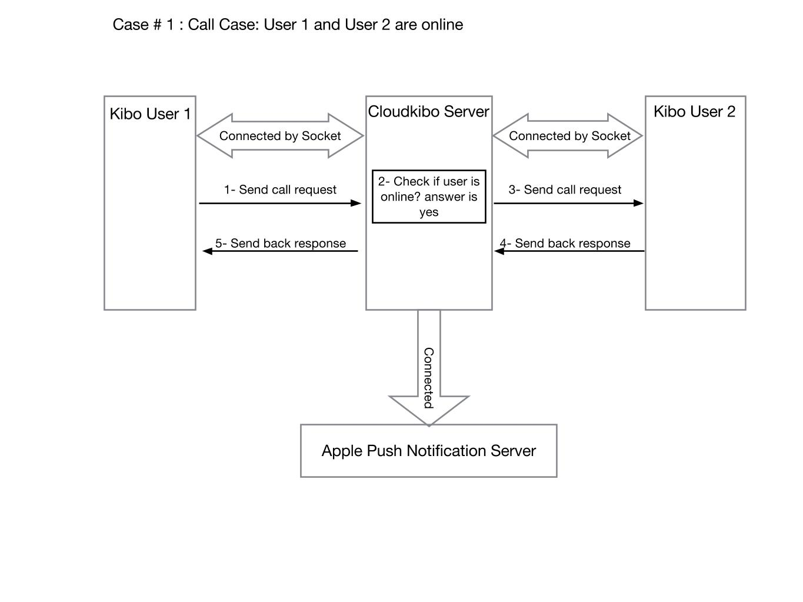
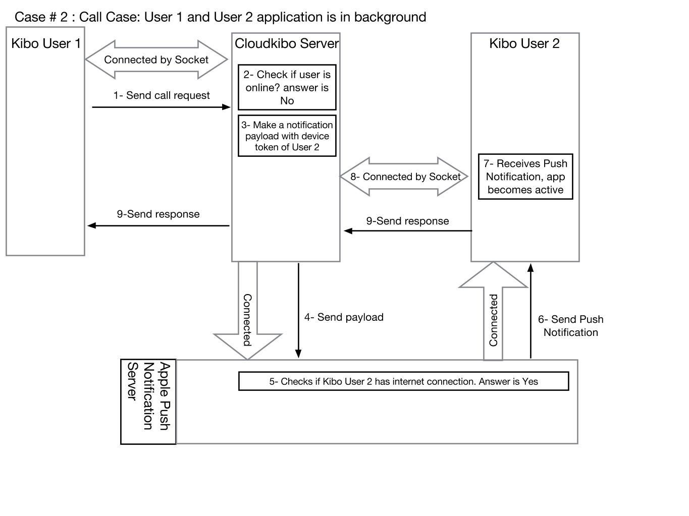
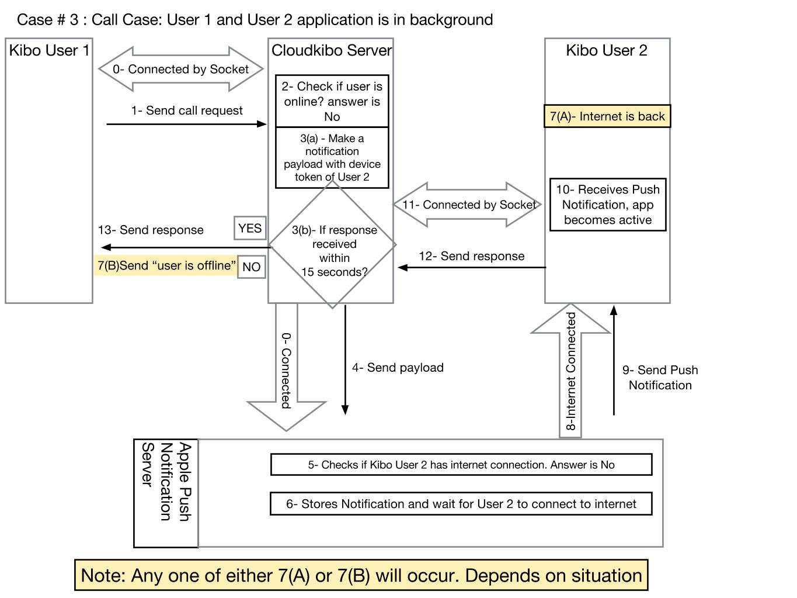
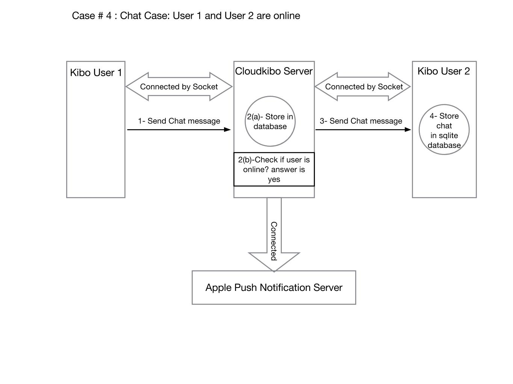
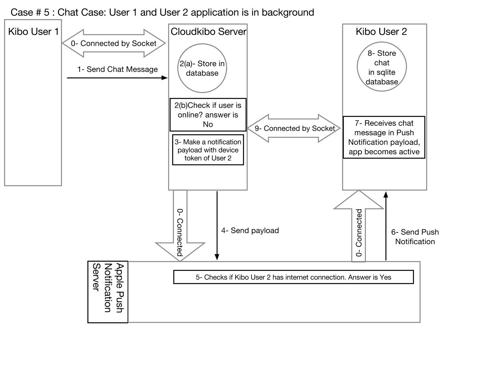

## Design with Push Notifications ##

Case # 1 : Call Case: User 1 and User 2 are online
Case # 2 : Call Case: User 1 and User 2 application is in background
Case # 3 : Call Case: User 1 and User 2 application is in background
Case # 4 : Chat Case: User 1 and User 2 are online
Case # 5 : Chat Case: User 1 and User 2 application is in background
Case # 6 : Chat Case: User 1 and User 2 is without internet

