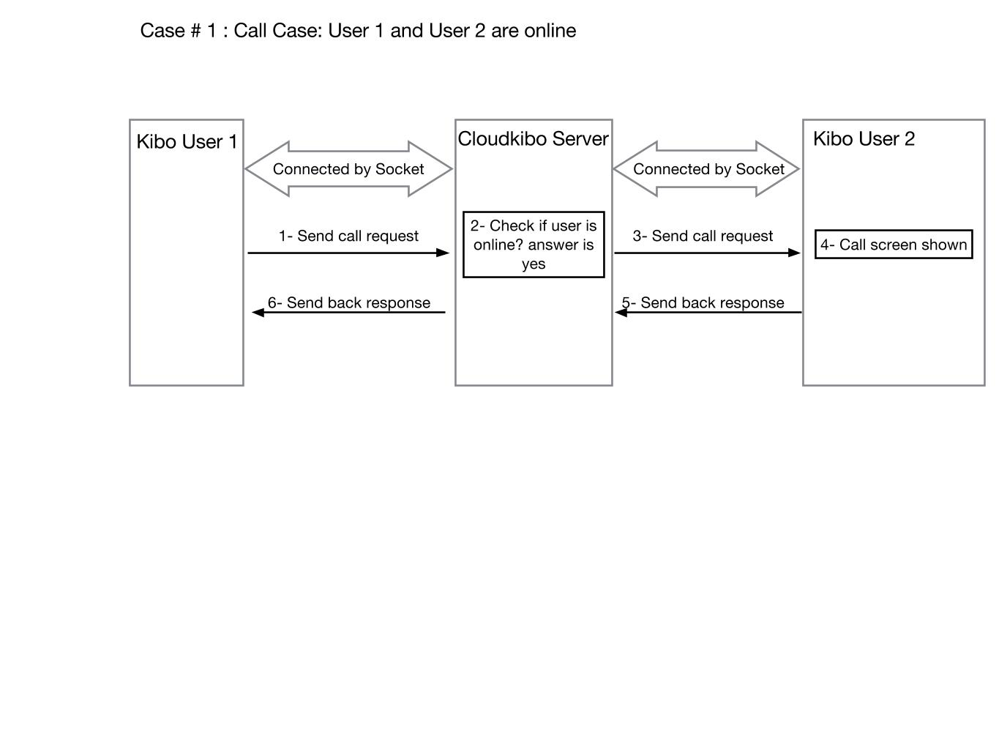
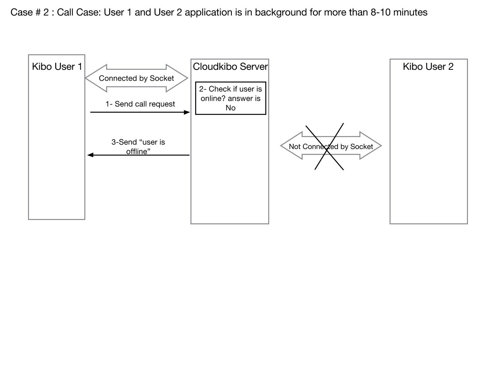
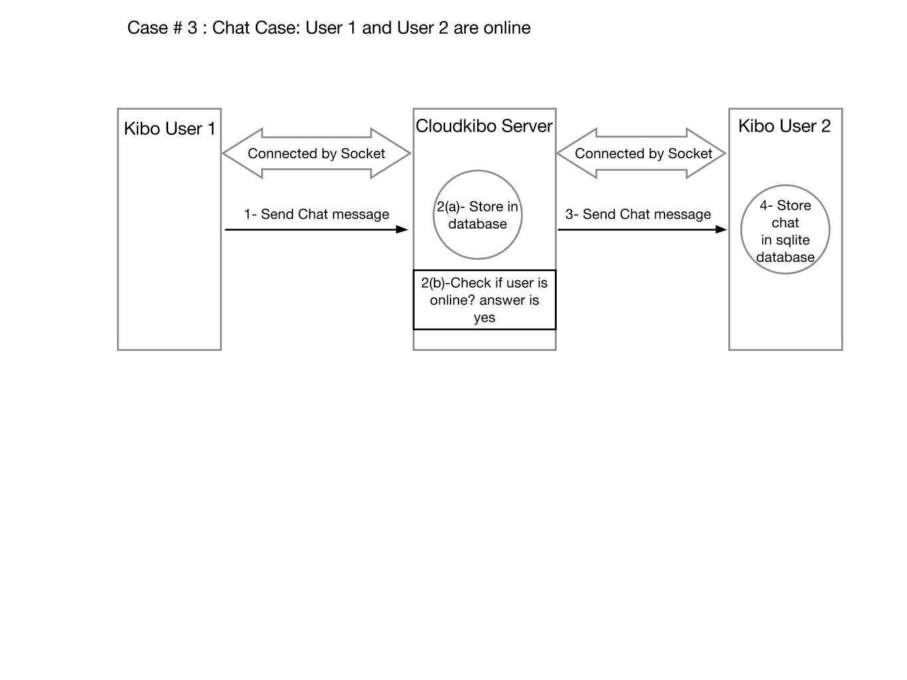
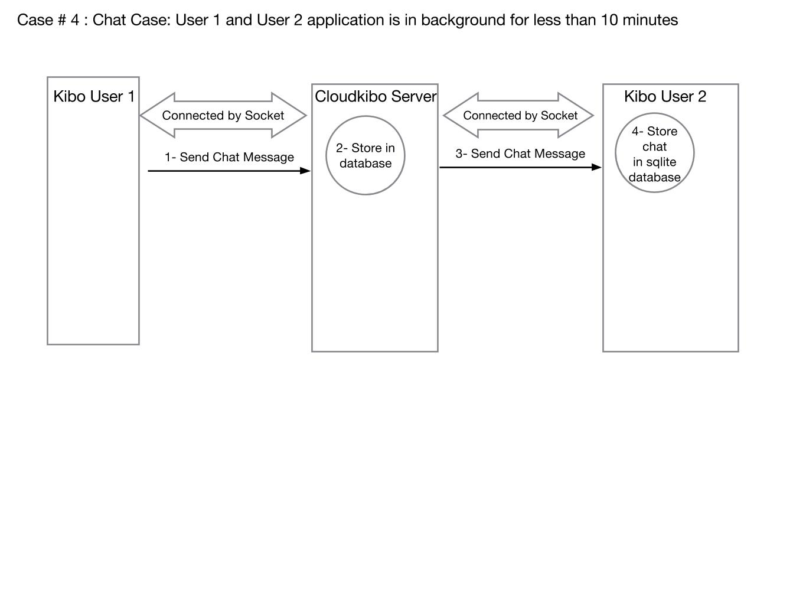

## Current Design with Socket ##

Case # 1 : Call Case: User 1 and User 2 are online
Case # 2 : Call Case: User 1 and User 2 application is in background for more than 8-10 minutes
Case # 3 : Chat Case: User 1 and User 2 are online
Case # 4 : Chat Case: User 1 and User 2 application is in background for less than 10 minutes 

