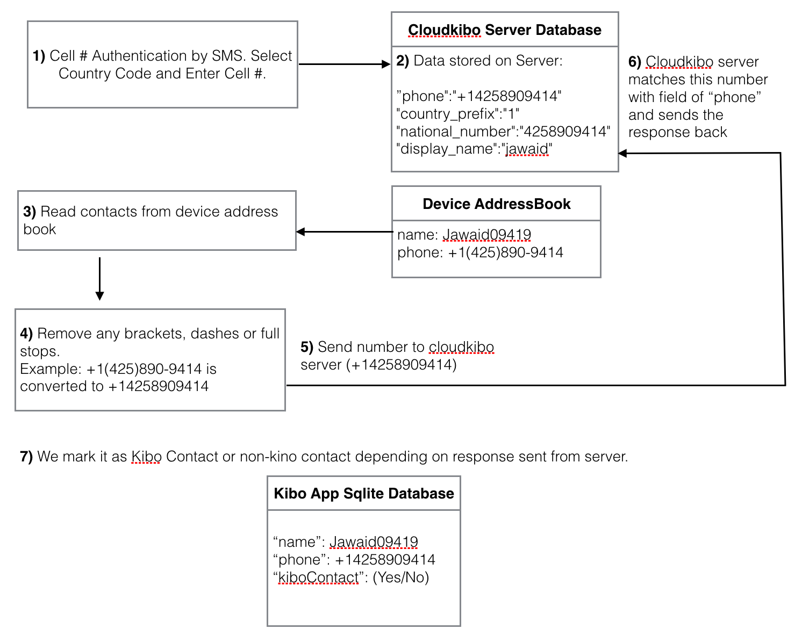

## Contacts Management in Kibo App ##

Each device has to maintain local copy of data of user in sqlite database. We do this so that data is shown to user even when offline. We synchronise local database with server database at the time of installation of application.

**Adding a friend**

Your friend's phone number must be in your phone's address book in order for you to start a chat with them in KiboApp.

If you cannot see your friend in WhatsApp, please follow these steps:

1- Ensure that your friend has KiboApp installed on their phone.

2- Double check that your friend's phone number is  entered correctly in your phone's address book.

- Enter the number same as you would if you were to make a phone call to that person.

- If this is an international phone number, do not use any exit codes or leading 0s. Start all international phone numbers with a + sign, followed by the country code. For specific examples and instructions, see this article.

3- Open KiboApp and open the Favorites list. It will show Contacts which are on KiboApp

Contacts in your phone's address book that have KiboApp will be displayed in the Favorites list (Contacts tab on Android). In KiboApp, you can only start a chat with these contacts.

If you still do not see your friend in your KiboApp list, it is possible that your friend does not have KiboApp.

**Contacts in Database on Server**

 On server side, our data is stored in Mongodb database. At the time of installation, we use Facebook AccountKit to authenticate phone number using SMS. It asks user to select country code from a list, enter mobile number and display name. After verification, contact details are stored on server in "accounts" table. Here is an example:

	"phone":"+14258909414"
	"country_prefix":"1"
	"national_number":"4258909414"
	"display_name":"jawaid"

 For contacts, we have a mongodb collection called contactslist. 

**Contacts in Kibo Application Database**

Kibo application expose functions like :

	Invite contact
	Load contacts from server
	Store/load contacts to and from sqlite database
	Do proper synchronization to update data on both sides

In sqlite database, we have the replica table of contactslist table of server. One other table that we have on iOS local database is to store contacts from user's address book (shown in Contacts tab). This table has following fields:

	name
	phone
	kiboContact (Yes/No)

Here is a basic flow diagram for Contacts Management:

